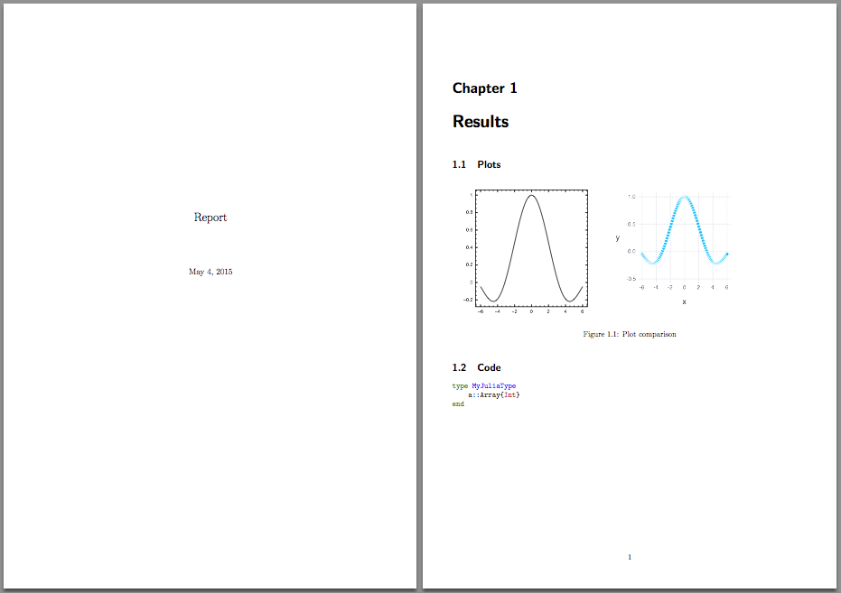

# Latex

[](https://travis-ci.org/rened/Latex.jl)

This package allows to construct Latex documents programmatically.

## Installation

It is assumed that you have `pdflatex` installed. You can then install `Latex.jl` like this:

```jl
Pkg.add("Latex")
```

## Example

```jl
x = linspace(-6,6,100)
y = sin(x)./x

import Winston
w = Image([], 7, Winston.plot(x, y))

import Gadfly
g = Image(7, 7, Gadfly.plot(x = x, y = y))

openpdf(report(Section("Plots",Figure("Plot comparison",Tabular({w,g})))))
```



## Available functions

`content` can always be either a single item or an array of items.

* `latex = report(content)` assembles the Latex file
* `openpdf(latex)` compiles the Latex file and tries to open it
* Section(title, content) creates a new section. A section is automatically translated to a Linux chapter, section or subsection according to its nesting
* Figure(caption, content)
* Table(caption content)
* Tabular(content)
* Image(height, width, Array or Winston.FramePlot or Gadfly.Plot), where the array can be either of size (m,n,1) or RGB (m,n,3), with the values in the range 0 to 1

## Todos

* make preable configurable
* adapt `openpdf` to linux

